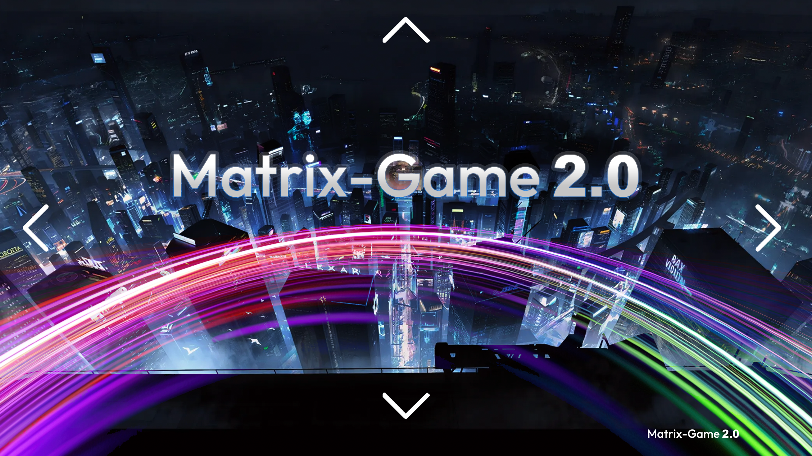

<h1 align="center">Matrix-Game</h1>
<h3 align="center">Skywork AI</h3>

## 📝 Overview

**Matrix-Game** is a series of open-source world models launched by Skywork AI.

This repository provides the official implementations of Matrix-Game-1.0 and Matrix-Game-2.0.

  

## 🔥🔥🔥 News!!
* Aug 12, 2025: 🔥 We released [Matrix-Game-2.0](https://github.com/SkyworkAI/Matrix-Game/tree/main/Matrix-Game-2). This is an interactive world foundation model for real-time long video generation.
* May 12, 2025: 🔥 We released [Matrix-Game-1.0](https://github.com/SkyworkAI/Matrix-Game/tree/main/Matrix-Game-1). The first open-source release of Skywork AI's Matrix-Game series world models.

## 📄 License

This project is licensed under the MIT License - see the [LICENSE](LICENSE) file for details.